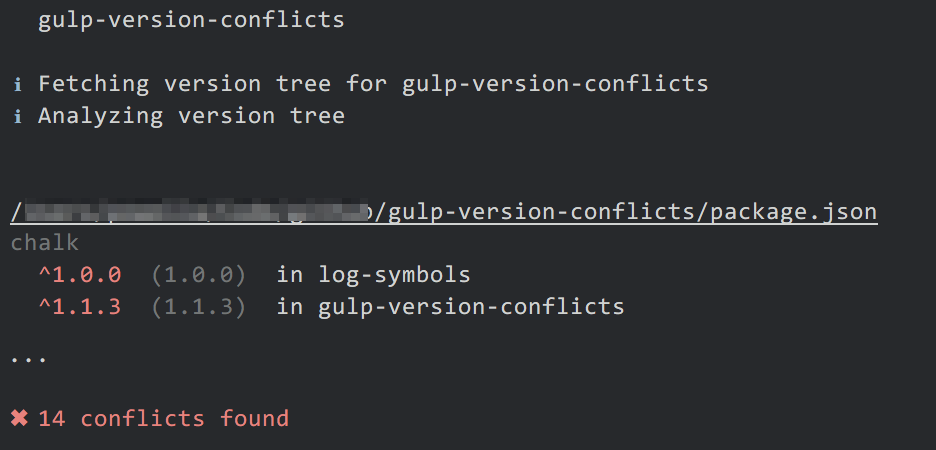

# gulp-version-conflicts [](https://travis-ci.org/shellscape/gulp-version-conflicts)

> Check for and report on module version conflicts for a package



## Install

```
$ npm install gulp-version-conflicts --save-dev
```

## Usage

```js
const gulp = require('gulp');
const conflicts = require('gulp-version-conflicts');

gulp.task('default', () =>
	gulp.src('package.json')
		.pipe(conflicts());
);
```

The default reporter follows the [stylish](https://github.com/sindresorhus/jshint-stylish)
format.

## License

MIT © [Andrew Powell](http://shellscape.org)
